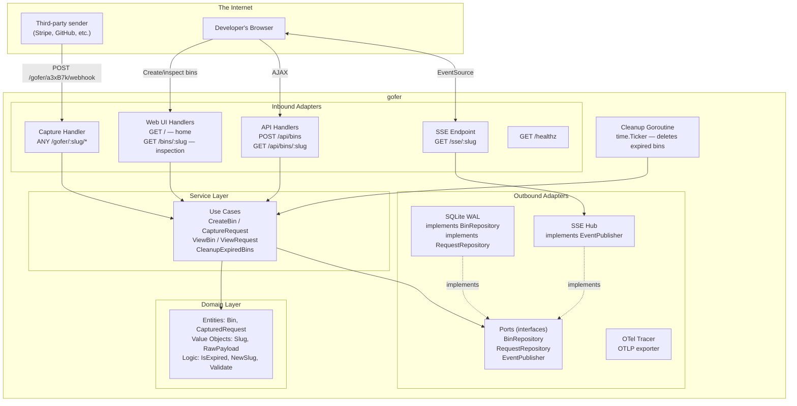
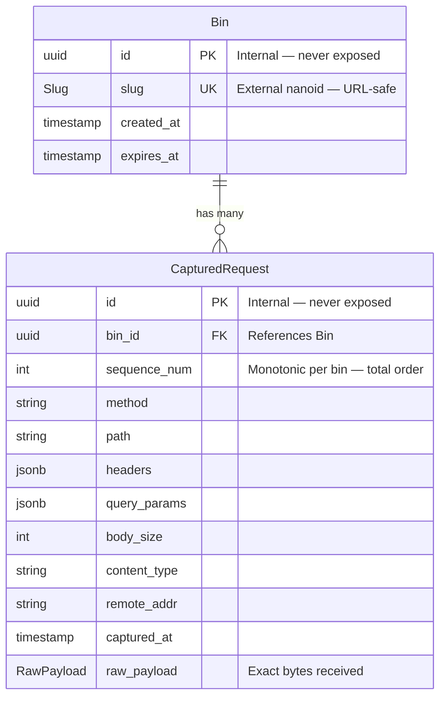

# gofer

  

## Problem

When integrating with third-party services that send HTTP requests to your endpoints (Stripe payment events, GitHub pushes, etc), it's not always clear what the shape of the request will be. OTel solves this for systems you control---instrument your HTTP client and you see outbound request details in traces. But you cannot add OTel to Stripe's HTTP client.

## Solution

With **gofer**, you deploy it to a public endpoint, hand the URL to the third-party service, and inspect every request that arrives in real time in your browser. 

Gofer is a single Go binary with an embedded web UI. Create a bin, get a public capture URL, point the third-party sender at it, and watch requests arrive via SSE. 

- **SQLite** with WAL mode for storage
- **SSE** for real-time push to the browser 
- **OTel traces** exported to any OTLP destination

## Architecture

### Flowchart

### ER Diagram

## Usage

Coming soon!